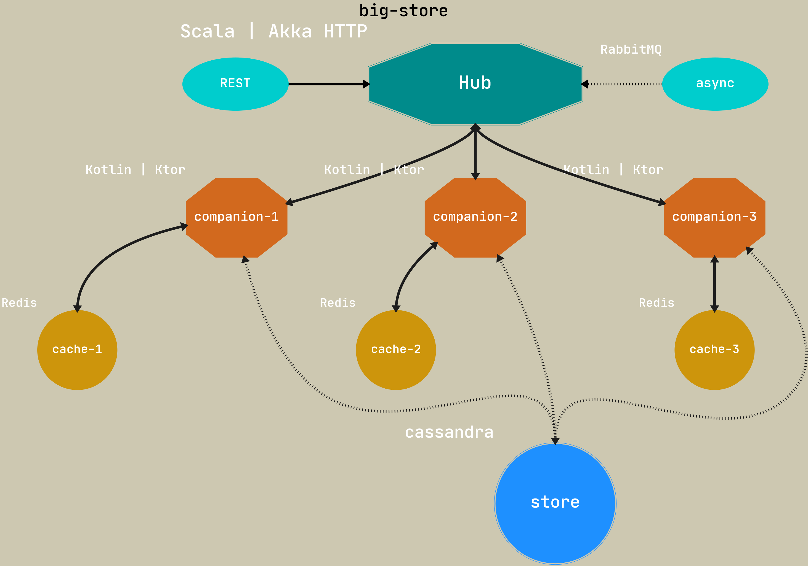
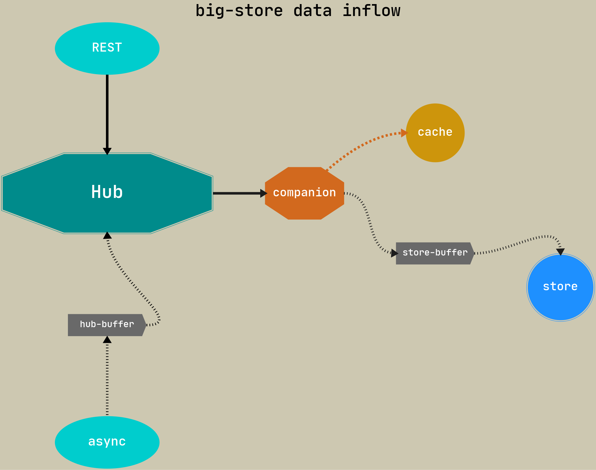
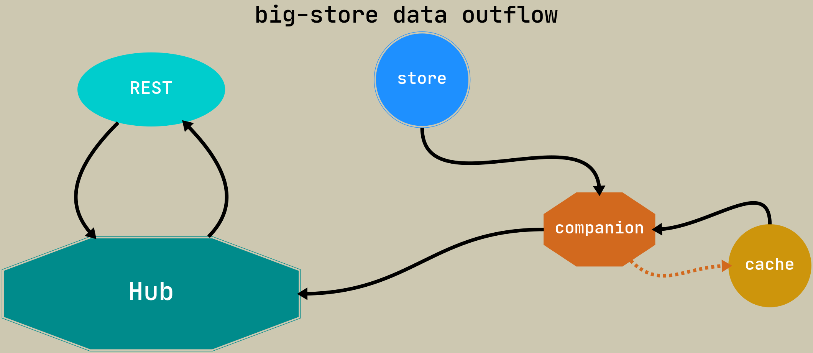

# big-store-wti
## Intro
Highly efficient system for storing large amounts of data with warranted GET time

## Table of contents
tba

## About
### Motivation
tba

### Sample deployment

### Data flows
#### Data inflow

tba

#### Data outflow

tba

## Deployment
### Preliminary
tba

### Build
tba

### Run
tba

## License
tba

## Credits
tba